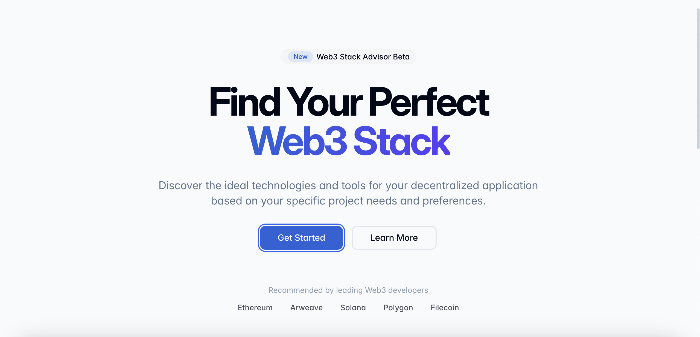

# Web3 Stack Genie



Web3 Stack Genie is an interactive tool that helps developers choose and configure the optimal tech stack for their Web3 projects. By answering a few questions about your project requirements, it generates personalized recommendations for blockchain platforms, development frameworks, and essential tools to kickstart your Web3 development journey

## Getting Started

### Prerequisites

- Node.js (LTS version recommended) - [install with nvm](https://github.com/nvm-sh/nvm#installing-and-updating)
- Git

### Local Development

```bash
# Clone the repository
git clone https://github.com/fusmanii/web3-stack-genie.git

# Navigate to the project directory
cd web3-stack-genie

# Install dependencies
npm install

# Start the development server
npm run dev
```

The development server will start and you can view your project at `http://localhost:8080`.

## Project Stack

This project is built with modern web technologies:

- [Vite](https://vitejs.dev/) - Next Generation Frontend Tooling
- [React](https://react.dev/) - Web Framework
- [TypeScript](https://www.typescriptlang.org/) - Type-safe JavaScript
- [shadcn/ui](https://ui.shadcn.com/) - Re-usable components
- [Tailwind CSS](https://tailwindcss.com/) - Utility-first CSS framework
